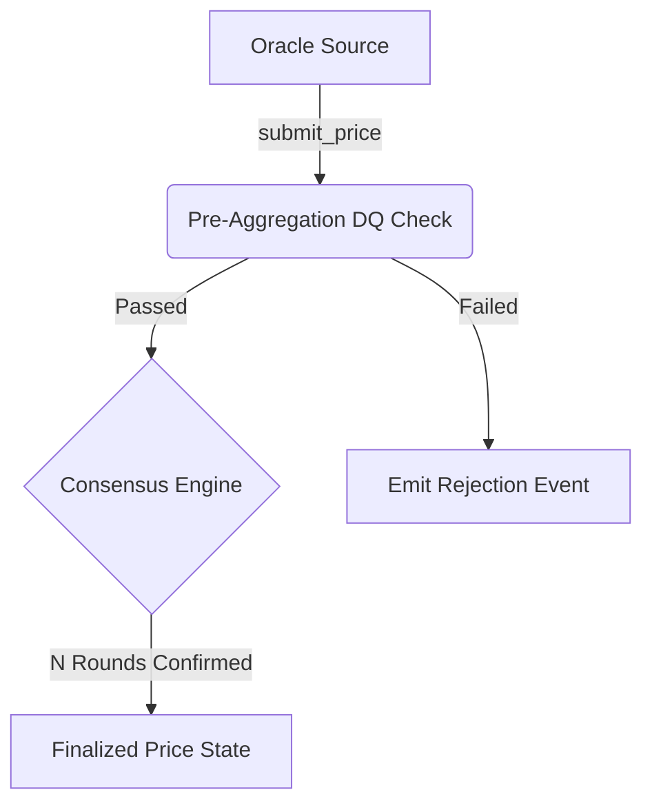

# Hackathon Bounty Track: Stellar Unified Price Oracle Aggregator

Welcome to the **Stellar Unified Price Oracle Aggregator Hackathon Bounty Track**! This document provides an all-in-one, reusable guide for builders, hackathon organizers, and developer communities integrating with or extending the Stellar Unified Price Oracle ecosystem on Soroban.

---

## Table of Contents

1. [Track Overview & Objectives](#1-track-overview--objectives)
2. [Curated Project Ideas (Mapped to Open Issues)](#2-curated-project-ideas-mapped-to-open-issues)
   - [Idea 1: Multi-Round Consensus Price Confirmation Engine (#397)](#idea-1-multi-round-consensus-price-confirmation-engine-397)
   - [Idea 2: Pre-Aggregation Data Quality & Anomaly Screening Pipeline (#398)](#idea-2-pre-aggregation-data-quality--anomaly-screening-pipeline-398)
   - [Idea 3: Cross-Source Price Comparison & Deviation Dashboard (#401)](#idea-3-cross-source-price-comparison--deviation-dashboard-401)
   - [Idea 4: Automated Oracle Source Onboarding & Bond Staking Pipeline (#402)](#idea-4-automated-oracle-source-onboarding--bond-staking-pipeline-402)
   - [Idea 5: Chaos Engineering & Network Partition Test Suite (#410)](#idea-5-chaos-engineering--network-partition-test-suite-410)
   - [Idea 6: Automated Blue-Green Contract Upgrade & Rollback Framework (#415)](#idea-6-automated-blue-green-contract-upgrade--rollback-framework-415)
   - [Idea 7: Real-Time Gas Consumption & Rent Budgeting Monitor (#417)](#idea-7-real-time-gas-consumption--rent-budgeting-monitor-417)
   - [Idea 8: Subscription Auto-Renewal with Token Approval Engine (#289)](#idea-8-subscription-auto-renewal-with-token-approval-engine-289)
3. [Evaluation & Judging Rubric](#3-evaluation--judging-rubric)
4. [Submission Template](#4-submission-template)
5. [Reward Tiers & Distribution Policy](#5-reward-tiers--distribution-policy)
6. [Developer Quick Start & Resources](#6-developer-quick-start--resources)

---

## 1. Track Overview & Objectives

The **Stellar Unified Price Oracle Aggregator** is a decentralized, SEP-40 compliant price oracle protocol designed for high-performance DeFi applications on the Stellar Network (Soroban). It ingests real-time feeds from multiple permissioned oracle providers, performs on-chain median aggregation to protect against outliers and flash attacks, and serves historical and real-time prices to consumer smart contracts.

### Core Objectives

- **Enhance Protocol Robustness:** Introduce advanced statistical validation, multi-round consensus, and chaos testing against network partitions.
- **Scale Ecosystem Tooling:** Build developer tools, live visualizers, gas profiling monitors, and automated onboarding pipelines.
- **Drive DeFi Adoption:** Enable seamless integration with Stellar lending protocols, automated market makers (AMMs), and synthetic asset platforms.

---

## 2. Curated Project Ideas (Mapped to Open Issues)

Below are 8 curated, hackathon-ready project ideas mapped directly to open issues and architectural components in the repository.

```
┌─────────────────────────────────────────────────────────────────────────────┐
│                      HACKATHON PROJECT TRACK MAP                            │
├───────────────────────────────┬─────────────────────────────────────────────┤
│ Core Smart Contracts          │ #397 Multi-Round Consensus Engine           │
│                               │ #398 Pre-Aggregation Data Quality Pipeline  │
│                               │ #289 Subscription Auto-Renewal Engine       │
├───────────────────────────────┼─────────────────────────────────────────────┤
│ DevOps, CI/CD & Reliability   │ #410 Chaos Engineering Test Harness         │
│                               │ #415 Blue-Green Upgrade & Rollback Pipeline │
├───────────────────────────────┼─────────────────────────────────────────────┤
│ Developer Tooling & Dashboards│ #401 Cross-Source Comparison Dashboard      │
│                               │ #402 Automated Source Onboarding Pipeline   │
│                               │ #417 Gas & Rent Budgeting Monitor           │
└───────────────────────────────┴─────────────────────────────────────────────┘
```

---

### Idea 1: Multi-Round Consensus Price Confirmation Engine (#397)

- **Reference Issue:** [#397](https://github.com/Stellar-Unified-Price-Oracle/Stellar-Unified-Price-Oracle-Aggregator-API-Contract/issues/397)
- **Category:** Core Smart Contracts & Mechanism Design
- **Difficulty:** Advanced (Soroban SDK / Rust)
- **Problem Statement:** Single-round price updates can be vulnerable to short-term oracle spikes or momentary misreporting. High-value DeFi operations (e.g. liquidations) require prices that hold consensus across consecutive ledger rounds.
- **Proposed Solution:**
  1. Implement a configurable multi-round confirmation state machine in `contracts/price-oracle/src/`.
  2. Require an asset price to remain within an $\epsilon$-band across $N$ consecutive ledger submission rounds before being marked as `Finalized`.
  3. Maintain single-round instant settlement as a configurable default to ensure backward compatibility with standard SEP-40 queries.
- **Deliverables:**
  - On-chain state structs for pending confirmation rounds.
  - Public contract methods: `get_finalized_price`, `get_pending_round_state`, `set_confirmation_rounds`.
  - Comprehensive unit and property tests proving state transition correctness.

---

### Idea 2: Pre-Aggregation Data Quality & Anomaly Screening Pipeline (#398)

- **Reference Issue:** [#398](https://github.com/Stellar-Unified-Price-Oracle/Stellar-Unified-Price-Oracle-Aggregator-API-Contract/issues/398)
- **Category:** Core Smart Contracts & Security
- **Difficulty:** Advanced (Soroban SDK / Fixed-Point Math)
- **Problem Statement:** Outlier submissions from misconfigured or lagging sources can distort price feeds before median filtering is applied.
- **Proposed Solution:**
  1. Build a pre-aggregation data quality (DQ) screening module that filters submissions before they enter the median calculation pool.
  2. Implement sanity checks: minimum/maximum absolute price bounds, maximum single-ledger rate-of-change, and z-score deviation screening.
  3. Emit detailed `DataQualityRejectedEvent` topics so off-chain monitoring systems can track disqualified data points in real time.
- **Deliverables:**
  - Rust module `contracts/price-oracle/src/data_quality.rs` integrated into `prices.rs`.
  - Admin governance endpoints for configuring asset-specific volatility and price bounds.
  - Test suite validating that bad source inputs are rejected while valid prices aggregate without regression.

---

### Idea 3: Cross-Source Price Comparison & Deviation Dashboard (#401)

- **Reference Issue:** [#401](https://github.com/Stellar-Unified-Price-Oracle/Stellar-Unified-Price-Oracle-Aggregator-API-Contract/issues/401)
- **Category:** Developer Tooling & Web3 Frontend
- **Difficulty:** Intermediate (TypeScript / React / Stellar Horizon & RPC)
- **Problem Statement:** Operators and consumers lack visual transparency into individual source contributions and latency differences across oracle providers.
- **Proposed Solution:**
  1. Develop a web dashboard that indexes on-chain `PriceSubmittedEvent` and `PriceUpdatedEvent` logs.
  2. Display real-time divergence charts comparing each source against the aggregated median price.
  3. Track historical reliability, uptime percentages, and latency metrics for each registered oracle source.
- **Deliverables:**
  - Modern web application (Next.js / Vite) connecting to Stellar testnet/mainnet RPC.
  - Interactive candlestick / deviation line charts with asset selector and timeframe filters.
  - Dockerfile and step-by-step setup documentation.

---

### Idea 4: Automated Oracle Source Onboarding & Bond Staking Pipeline (#402)

- **Reference Issue:** [#402](https://github.com/Stellar-Unified-Price-Oracle/Stellar-Unified-Price-Oracle-Aggregator-API-Contract/issues/402)
- **Category:** Governance, Tooling & Smart Contracts
- **Difficulty:** Intermediate (Rust / TypeScript / Soroban CLI)
- **Problem Statement:** Adding new oracle sources currently requires manual admin coordination and lacks automated economic bonding or probation checks.
- **Proposed Solution:**
  1. Create a standardized onboarding workflow where prospective oracle providers submit an identity claim and stake an escrowed bond (e.g. XLM or USDC).
  2. Implement an automated probation mechanism: newly registered sources must submit consistent prices during a test window before their submissions count toward the live median.
  3. Provide an automated offboarding and slashing trigger if a source exceeds allowable downtime or deviation limits.
- **Deliverables:**
  - Bonding contract or module extension with staking, slashing, and withdrawal logic.
  - CLI automation script (`scripts/onboard-source.sh`) guiding new providers through keypair generation, bonding, and test submission.
  - End-to-end simulation tests on Soroban testnet.

---

### Idea 5: Chaos Engineering & Network Partition Test Suite (#410)

- **Reference Issue:** [#410](https://github.com/Stellar-Unified-Price-Oracle/Stellar-Unified-Price-Oracle-Aggregator-API-Contract/issues/410)
- **Category:** Security, Testing & Protocol Reliability
- **Difficulty:** Advanced (Rust / Integration Testing)
- **Problem Statement:** Oracle behavior under severe network degradation (RPC delays, ledger reorgs, out-of-order submissions) needs systematic automated verification.
- **Proposed Solution:**
  1. Build a chaos test harness that injects artificial latency, dropped transactions, and reordered submissions against contract test instances.
  2. Verify critical protocol invariants: no double-finalization, graceful handling of expired timestamps, and proper fallback when fewer than `min_sources_required` respond.
  3. Produce a structured Chaos Report detailing recovery times and edge-case behaviors.
- **Deliverables:**
  - Test harness located under `contracts/price-oracle/src/chaos_tests.rs` or integration test suite.
  - Configurable fault-injection profiles (High Latency, 50% Source Drop, Corrupted Timestamps).
  - CI integration script with passing chaos regression tests.

---

### Idea 6: Automated Blue-Green Contract Upgrade & Rollback Framework (#415)

- **Reference Issue:** [#415](https://github.com/Stellar-Unified-Price-Oracle/Stellar-Unified-Price-Oracle-Aggregator-API-Contract/issues/415)
- **Category:** DevOps, CI/CD & Operations
- **Difficulty:** Intermediate-Advanced (Shell / Rust / GitHub Actions)
- **Problem Statement:** Upgrading on-chain WASM contracts carries catastrophic risk if state migration fails or post-deploy health checks fail.
- **Proposed Solution:**
  1. Build a zero-downtime blue-green upgrade deployment pipeline for Soroban contracts.
  2. The pipeline deploys the new WASM binary, verifies state schema integrity against live contract state, executes canary health queries, and automatically executes rollback to the previous WASM hash if any check fails.
  3. Integrate with GitHub Actions to allow automated staged deployments to Stellar testnet.
- **Deliverables:**
  - Automation scripts in `scripts/blue-green-upgrade.sh` and `scripts/verify-migration.sh`.
  - Comprehensive rollback state machine handling timelocked admin operations.
  - End-to-end CI test exercising upgrade, verification, simulated fault, and automated rollback.

---

### Idea 7: Real-Time Gas Consumption & Rent Budgeting Monitor (#417)

- **Reference Issue:** [#417](https://github.com/Stellar-Unified-Price-Oracle/Stellar-Unified-Price-Oracle-Aggregator-API-Contract/issues/417)
- **Category:** Monitoring, Analytics & Infrastructure
- **Difficulty:** Intermediate (TypeScript / Python / Grafana)
- **Problem Statement:** Operators must forecast ongoing gas, CPU instruction budgets, and ledger storage rent to prevent contract archival or budget depletion.
- **Proposed Solution:**
  1. Build an off-chain telemetry ingestor that monitors CPU instructions, RAM allocations, and storage ledger write footprints across all 27 contract endpoints.
  2. Provide a predictive budgeting dashboard that models monthly cost projections based on submission frequencies and asset count.
  3. Include configurable alerts when any endpoint's gas consumption exceeds configured safety thresholds.
- **Deliverables:**
  - Gas telemetry exporter parsing Soroban RPC transaction simulation results.
  - Interactive Grafana dashboard configuration (`docs/monitoring/gas-dashboard.json`) and standalone web visualizer.
  - Comprehensive documentation on gas optimization techniques for oracle consumers.

---

### Idea 8: Subscription Auto-Renewal with Token Approval Engine (#289)

- **Reference Issue:** [#289](https://github.com/Stellar-Unified-Price-Oracle/Stellar-Unified-Price-Oracle-Aggregator-API-Contract/issues/289)
- **Category:** DeFi Integration & Consumer Contracts
- **Difficulty:** Intermediate (Soroban SDK / Rust)
- **Problem Statement:** Premium consumer contracts (e.g. sub-second feeds, custom volatility metrics) require automated subscription renewal without manual per-epoch payments.
- **Proposed Solution:**
  1. Implement a subscription manager contract that uses Soroban token approvals (`approve`/`transfer_from`) to automatically deduct renewal fees from consumer wallets or contracts.
  2. Support flexible billing tiers (per-ledger, hourly, monthly) and grace periods for failed payments.
  3. Provide an interface for consumer smart contracts to query their active entitlement status before fetching proprietary data.
- **Deliverables:**
  - Subscription contract in `contracts/subscription-manager/` or integrated module.
  - End-to-end billing tests demonstrating approval, deduction, expiration, and renewal flows.
  - Client SDK examples demonstrating how consumer contracts check subscription status.

---

## 3. Evaluation & Judging Rubric

Submissions will be evaluated by an independent panel of judges across five weighted categories:

```
┌─────────────────────────────────────────────────────────────────────────────┐
│                       JUDGING EVALUATION RUBRIC                             │
├───────────────────────────────────────┬────────────┬────────────────────────┤
│ Dimension                             │ Weight     │ Max Points             │
├───────────────────────────────────────┼────────────┼────────────────────────┤
│ 1. Technical Execution & Code Quality │ 25%        │ 25 pts                 │
│ 2. Architecture, Security & Integrity │ 25%        │ 25 pts                 │
│ 3. Soroban & Stellar Best Practices   │ 20%        │ 20 pts                 │
│ 4. Completeness & Practical Utility   │ 15%        │ 15 pts                 │
│ 5. Testing Rigor & Documentation      │ 15%        │ 15 pts                 │
├───────────────────────────────────────┼────────────┼────────────────────────┤
│ TOTAL                                 │ 100%       │ 100 pts                │
└───────────────────────────────────────┴────────────┴────────────────────────┘
```

### Detailed Scoring Breakdown

#### 1. Technical Execution & Code Quality (25 Points)
- **Code Cleanliness (10 pts):** Clean, idiomatic Rust/TypeScript with clear modularization and zero compiler/linter warnings.
- **Performance & Efficiency (10 pts):** Optimal algorithm complexity, minimal storage read/write overhead, and adherence to WASM size limits.
- **Error Handling (5 pts):** Comprehensive custom error enum coverage with informative revert reasons.

#### 2. Architecture, Security & Integrity (25 Points)
- **Authorization Enforcement (10 pts):** Strict caller verification (`require_auth()`) on all state-modifying endpoints.
- **Cryptographic & Math Integrity (10 pts):** Use of genuine mathematical/cryptographic primitives without mock stubs or bypassed assertions.
- **Attack Resistance (5 pts):** Robustness against sandwich attacks, flash loans, front-running, and input manipulation.

#### 3. Soroban & Stellar Best Practices (20 Points)
- **SEP-40 Alignment (10 pts):** Strict compatibility with Stellar Oracle Consumer Standards and native data structures.
- **State & Rent Management (10 pts):** Proper utilization of persistent vs. temporary storage and TTL extension routines.

#### 4. Completeness & Practical Utility (15 Points)
- **Scope Delivery (10 pts):** Delivery of all promised features and deliverables specified in the issue.
- **User/Developer Experience (5 pts):** Intuitive APIs, straightforward deployment scripts, and clear interfaces.

#### 5. Testing Rigor & Documentation (15 Points)
- **Test Coverage (10 pts):** Thorough unit, property, and integration tests covering both happy paths and edge cases.
- **Documentation (5 pts):** Clear architectural explanations, quick-start guides, and step-by-step verification commands.

### Automatic Disqualification Flags
Projects exhibiting any of the following will be disqualified immediately:
- ❌ Mocked cryptographic proofs or faked test assertions.
- ❌ State-modifying endpoints lacking authorization checks.
- ❌ Code that fails to compile on `wasm32v1-none` or breaks existing test suites.
- ❌ Plagiarized code without proper attribution and license compliance.

---

## 4. Submission Template

Participants must include a completed `SUBMISSION.md` file in their repository root or Pull Request description using the template below:

```markdown
# Hackathon Project Submission: [Project Title]

## Project Metadata
- **Track:** [e.g. Core Smart Contracts / Tooling / Analytics / DeFi]
- **Target Issue:** [e.g. Issue #397 / #398 / #401 / etc.]
- **Team Name / Author:** [Your Name or Team Name]
- **GitHub Handles:** [@handle1, @handle2]
- **Contact Email / Discord:** [email@domain.com / discord#0000]

---

## 1. Executive Summary
Briefly describe your project, the problem it solves, and why your solution is valuable for the Stellar oracle ecosystem (2–4 paragraphs).

---

## 2. Technical Architecture & Design
Explain the high-level architecture of your solution. Include flowcharts or Mermaid diagrams where appropriate.



### Key Components:
- **Component A (`path/to/file.rs`):** Description of function and role.
- **Component B (`path/to/file.ts`):** Description of function and role.

---

## 3. On-Chain Deployment & Live Demo (if applicable)
- **Network:** Stellar Testnet
- **Contract Address:** `C...`
- **WASM Hash:** `...`
- **Live Demo / Web App Link:** https://your-demo-url.com
- **Video Walkthrough (Loom/YouTube):** https://loom.com/share/...

---

## 4. Verification & Testing Guide
Provide exact, copy-pasteable commands so judges can build and verify your submission locally:

```bash
# 1. Clone repository
git clone https://github.com/your-org/your-repo.git
cd your-repo

# 2. Compile WASM contract
make build

# 3. Run full test suite
make test

# 4. Run lint and formatting checks
make lint
make check
```

---

## 5. Security & Risk Considerations
Detail the security measures implemented (e.g. auth checks, reentrancy guards, overflow protections) and any remaining risks.

---

## 6. Payout Routing
- **EVM Address (Base/Arbitrum/Polygon/ETH):** `0x...`
- **Stellar Address (XLM/USDC):** `G...`
```

---

## 5. Reward Tiers & Distribution Policy

The hackathon bounty track features a tiered prize pool designed to reward outstanding technical contributions, with follow-on grant opportunities for production-ready solutions:

```
┌─────────────────────────────────────────────────────────────────────────────┐
│                         PRIZE POOL BREAKDOWN                                │
├──────────────────────┬──────────────────────┬───────────────────────────────┤
│ Tier                 │ Reward (USD Eq.)     │ Additional Benefits           │
├──────────────────────┼──────────────────────┼───────────────────────────────┤
│ 🥇 Platinum (1st)    │ $5,000 in XLM/USDC   │ Fast-Track Foundation Grant   │
│ 🥈 Gold (2nd)        │ $3,000 in XLM/USDC   │ Core Contributor Recognition  │
│ 🥉 Silver (3rd)      │ $1,500 in XLM/USDC   │ Mentorship & Review Priority  │
│ 🏅 Category Bounties │ $500 (up to 4 teams) │ Protocol Showcase Feature     │
├──────────────────────┼──────────────────────┼───────────────────────────────┤
│ TOTAL PRIZE POOL     │ $11,500+             │                               │
└──────────────────────┴──────────────────────┴───────────────────────────────┘
```

### Payout Disbursement Terms

1. **Escrow & Verification:** All rewards are escrowed prior to hackathon launch. Payouts are distributed following formal judging evaluation and successful Victory Audits.
2. **Supported Payout Channels:**
   - **Stellar Native (Recommended):** Direct transfer of XLM or Stellar USDC to the winner's `G...` address.
   - **EVM Multi-Chain:** USDT/USDC on Base, Arbitrum, Polygon, or Ethereum Mainnet to the winner's `0x...` address.
3. **Milestone Acceptance:** For prize distribution, code must be submitted via an open Pull Request against the upstream repository, pass all automated CI workflows, and satisfy the judging criteria without unaddressed critical security vulnerabilities.

---

## 6. Developer Quick Start & Resources

### Prerequisites

- **Rust:** Stable toolchain (`rustc --version >= 1.80.0`) with `wasm32v1-none` target.
- **Stellar CLI:** `cargo install --locked stellar-cli --version "^23"`
- **Node.js:** Node 20+ and npm (for scripts and web tools).

### Building & Testing

```bash
# Clone the repository
git clone https://github.com/Stellar-Unified-Price-Oracle/Stellar-Unified-Price-Oracle-Aggregator-API-Contract.git
cd Stellar-Unified-Price-Oracle-Aggregator-API-Contract

# Build release WASM binary
make build

# Run unit and property tests
make test

# Check code formatting and clippy linter
make check
make lint
```

### Essential References

- **[System Architecture](ARCHITECTURE.md):** Complete contract design, data models, and storage key mappings.
- **[SEP-40 Specification](https://github.com/stellar/stellar-protocol/blob/master/ecosystem/sep-0040.md):** Stellar Oracle Consumer Interface standard.
- **[Error Code Registry](error-codes.md):** Exhaustive catalog of contract error codes and resolutions.
- **[Security Audit Checklist](security-audit-checklist.md):** Security guardrails and anti-cheating protocols.
- **[SLA & Performance Targets](SLA.md):** Price freshness and uptime benchmarks.

---

*Happy Bountying! For questions and track support, open an issue or reach out via Stellar Community Discord.*
